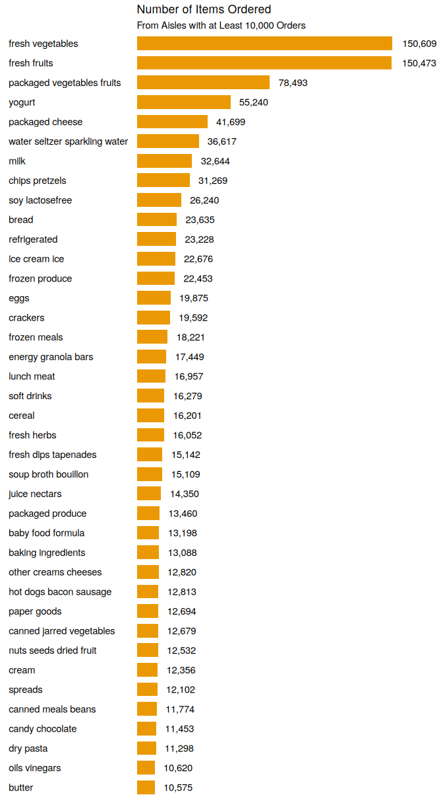

Homework 3
================
Joshua Carpenter
2023-10-14

``` r
library(tidyverse)
library(p8105.datasets)
library(scales)
library(knitr)
data("instacart")
```

## Problem 1

The `instacart` dataset contains order history from the online shopping
service Instacart in 2017. The dataset has one row per item per order
and contains info about when the order was placed, whether the customer
had bought the item before, and which aisle the item came from. Here are
a few rows from the dataset:

| order_id | product_id | add_to_cart_order | reordered | user_id | eval_set | order_number | order_dow | order_hour_of_day | days_since_prior_order | product_name                                         | aisle_id | department_id | aisle                      | department      |
|---------:|-----------:|------------------:|----------:|--------:|:---------|-------------:|----------:|------------------:|-----------------------:|:-----------------------------------------------------|---------:|--------------:|:---------------------------|:----------------|
|       36 |      39612 |                 1 |         0 |   79431 | train    |           23 |         6 |                18 |                     30 | Grated Pecorino Romano Cheese                        |        2 |            16 | specialty cheeses          | dairy eggs      |
|      226 |      36291 |                 8 |         0 |   51011 | train    |            4 |         0 |                12 |                     30 | Maximum Strength Original Paste Diaper Rash Ointment |        6 |             2 | other                      | other           |
|      844 |      18599 |                 6 |         1 |   27766 | train    |           10 |         6 |                15 |                     11 | Garlic Couscous                                      |        4 |             9 | instant foods              | dry goods pasta |
|      878 |      48070 |                 1 |         1 |   61911 | train    |            9 |         2 |                13 |                     30 | Chocolate Mint Crisp Protein Bar                     |        3 |            19 | energy granola bars        | snacks          |
|     1139 |      45757 |                 6 |         0 |   34221 | train    |            4 |         5 |                 7 |                     30 | Picnic Potato Salad                                  |        1 |            20 | prepared soups salads      | deli            |
|     5466 |      33560 |                21 |         0 |   43745 | train    |            4 |         6 |                18 |                     18 | Italian Bread Crumbs                                 |        5 |            13 | marinades meat preparation | pantry          |

I just realized this problem is worth zero points, so I’m not going to
put any more work into it, but here are some nice tables and figures:

``` r
# Bar chart
instacart %>%
  group_by(aisle_id, aisle) %>%
  count() %>%
  arrange(n) %>%
  filter(n >= 10000) %>%
  ggplot(mapping = aes(x = n, y = factor(aisle, levels = aisle))) +
  geom_col(width = 0.7, fill = '#ea9905') +
  geom_text(aes(label = comma(n)), hjust = -0.3) +
  theme_void() +
  theme(axis.text.y = element_text(hjust = 0, 
                                   margin = margin(r = 10, l = 10))) +
  scale_x_continuous(expand = expansion(mult = c(0, 0.2))) +
  xlab("") +
  ylab("") +
  ggtitle("Number of Items Ordered", "From Aisles with at Least 10,000 Orders")
```

<!-- -->

#### Top Ordered Items from Select Aisles

``` r
# Table
instacart %>%
  group_by(aisle_id, aisle, product_id, product_name) %>%
  filter(aisle %in% c("baking ingredients", "dog food care", 
                      "packaged vegetables fruits")) %>%
  count() %>%
  ungroup() %>%
  slice_max(n, by = aisle_id, n = 3) %>%
  select(-ends_with("_id")) %>%
  kable(col.names = c("Aisle", "Product", "Number Ordered"))
```

| Aisle                      | Product                                       | Number Ordered |
|:---------------------------|:----------------------------------------------|---------------:|
| baking ingredients         | Light Brown Sugar                             |            499 |
| baking ingredients         | Pure Baking Soda                              |            387 |
| baking ingredients         | Cane Sugar                                    |            336 |
| dog food care              | Snack Sticks Chicken & Rice Recipe Dog Treats |             30 |
| dog food care              | Organix Chicken & Brown Rice Recipe           |             28 |
| dog food care              | Small Dog Biscuits                            |             26 |
| packaged vegetables fruits | Organic Baby Spinach                          |           9784 |
| packaged vegetables fruits | Organic Raspberries                           |           5546 |
| packaged vegetables fruits | Organic Blueberries                           |           4966 |

#### Average Time of Day (hours since midnight) for Orders of Coffee Ice Cream and Pink Lady Apples

``` r
# Assuming that 0 is Sunday, since the data description doesn't specify
dow <- c("Sunday", "Monday", "Tuesday", "Wednesday", "Thursday", 
         "Friday", "Saturday")

instacart %>%
  filter(product_name %in% c("Pink Lady Apples", "Coffee Ice Cream")) %>%
  group_by(product_name, order_dow) %>%
  summarise(mean = round(mean(order_hour_of_day), 1)) %>%
  mutate(order_dow = dow[order_dow + 1]) %>%
  pivot_wider(names_from = product_name, values_from = mean) %>%
  rename(`Day of Week` = order_dow) %>%
  kable()
```

| Day of Week | Coffee Ice Cream | Pink Lady Apples |
|:------------|-----------------:|-----------------:|
| Sunday      |             13.8 |             13.4 |
| Monday      |             14.3 |             11.4 |
| Tuesday     |             15.4 |             11.7 |
| Wednesday   |             15.3 |             14.2 |
| Thursday    |             15.2 |             11.6 |
| Friday      |             12.3 |             12.8 |
| Saturday    |             13.8 |             11.9 |
