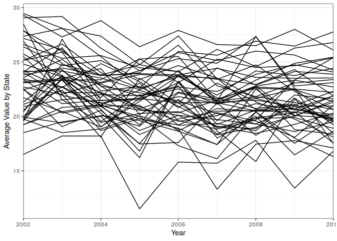
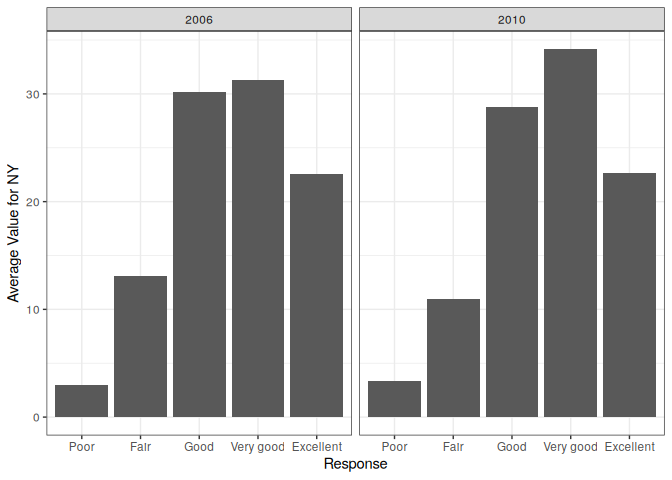
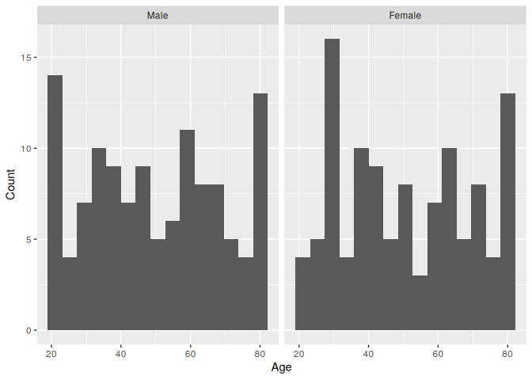
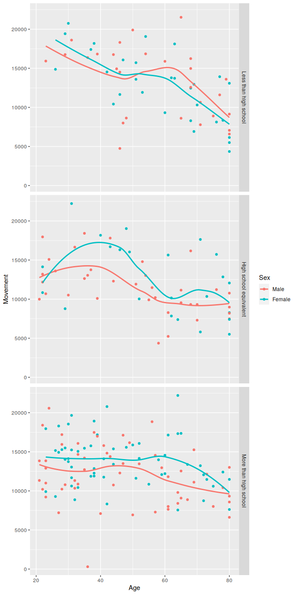
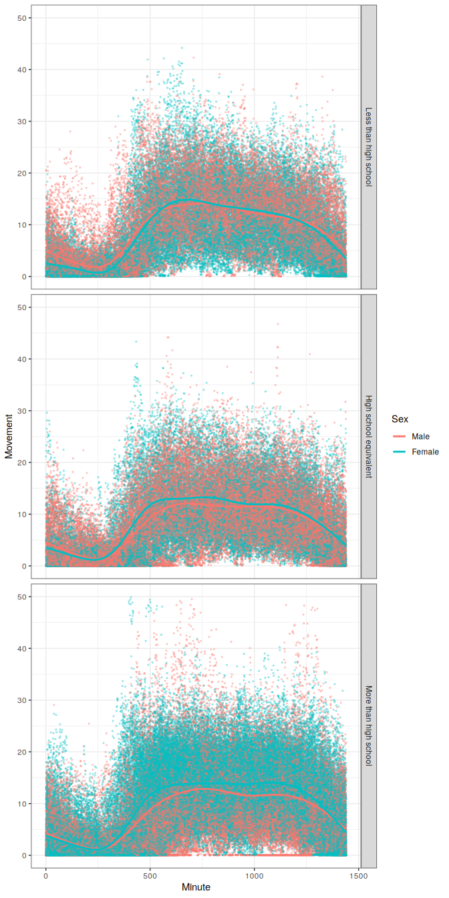

Homework 3
================
Joshua Carpenter
2023-10-14

``` r
library(tidyverse)
library(p8105.datasets)
library(scales)
library(knitr)
library(janitor)
data("instacart")
data("brfss_smart2010")
```

## Problem 1

The `instacart` dataset contains order history from the online shopping
service Instacart in 2017. The dataset has one row per item per order
and contains info about when the order was placed, whether the customer
had bought the item before, and which aisle the item came from. Here are
a few rows from the dataset:

| order_id | product_id | add_to_cart_order | reordered | user_id | eval_set | order_number | order_dow | order_hour_of_day | days_since_prior_order | product_name                                         | aisle_id | department_id | aisle                      | department      |
|---------:|-----------:|------------------:|----------:|--------:|:---------|-------------:|----------:|------------------:|-----------------------:|:-----------------------------------------------------|---------:|--------------:|:---------------------------|:----------------|
|       36 |      39612 |                 1 |         0 |   79431 | train    |           23 |         6 |                18 |                     30 | Grated Pecorino Romano Cheese                        |        2 |            16 | specialty cheeses          | dairy eggs      |
|      226 |      36291 |                 8 |         0 |   51011 | train    |            4 |         0 |                12 |                     30 | Maximum Strength Original Paste Diaper Rash Ointment |        6 |             2 | other                      | other           |
|      844 |      18599 |                 6 |         1 |   27766 | train    |           10 |         6 |                15 |                     11 | Garlic Couscous                                      |        4 |             9 | instant foods              | dry goods pasta |
|      878 |      48070 |                 1 |         1 |   61911 | train    |            9 |         2 |                13 |                     30 | Chocolate Mint Crisp Protein Bar                     |        3 |            19 | energy granola bars        | snacks          |
|     1139 |      45757 |                 6 |         0 |   34221 | train    |            4 |         5 |                 7 |                     30 | Picnic Potato Salad                                  |        1 |            20 | prepared soups salads      | deli            |
|     5466 |      33560 |                21 |         0 |   43745 | train    |            4 |         6 |                18 |                     18 | Italian Bread Crumbs                                 |        5 |            13 | marinades meat preparation | pantry          |

I just realized this problem is worth zero points, so I’m not going to
put any more work into it, but here are some nice tables and figures:

``` r
# Bar chart
instacart %>%
  group_by(aisle_id, aisle) %>%
  count() %>%
  arrange(n) %>%
  filter(n >= 10000) %>%
  ggplot(mapping = aes(x = n, y = factor(aisle, levels = aisle))) +
  geom_col(width = 0.7, fill = '#ea9905') +
  geom_text(aes(label = comma(n)), hjust = -0.3) +
  theme_void() +
  theme(axis.text.y = element_text(hjust = 0, 
                                   margin = margin(r = 10, l = 10))) +
  scale_x_continuous(expand = expansion(mult = c(0, 0.2))) +
  xlab("") +
  ylab("") +
  ggtitle("Number of Items Ordered", "From Aisles with at Least 10,000 Orders")
```

<!-- -->

#### Top Ordered Items from Select Aisles

``` r
# Table
instacart %>%
  group_by(aisle_id, aisle, product_id, product_name) %>%
  filter(aisle %in% c("baking ingredients", "dog food care", 
                      "packaged vegetables fruits")) %>%
  count() %>%
  ungroup() %>%
  slice_max(n, by = aisle_id, n = 3) %>%
  select(-ends_with("_id")) %>%
  kable(col.names = c("Aisle", "Product", "Number Ordered"))
```

| Aisle                      | Product                                       | Number Ordered |
|:---------------------------|:----------------------------------------------|---------------:|
| baking ingredients         | Light Brown Sugar                             |            499 |
| baking ingredients         | Pure Baking Soda                              |            387 |
| baking ingredients         | Cane Sugar                                    |            336 |
| dog food care              | Snack Sticks Chicken & Rice Recipe Dog Treats |             30 |
| dog food care              | Organix Chicken & Brown Rice Recipe           |             28 |
| dog food care              | Small Dog Biscuits                            |             26 |
| packaged vegetables fruits | Organic Baby Spinach                          |           9784 |
| packaged vegetables fruits | Organic Raspberries                           |           5546 |
| packaged vegetables fruits | Organic Blueberries                           |           4966 |

#### Average Time of Day (hours since midnight) for Orders of Coffee Ice Cream and Pink Lady Apples

``` r
# Assuming that 0 is Sunday, since the data description doesn't specify
dow <- c("Sunday", "Monday", "Tuesday", "Wednesday", "Thursday", 
         "Friday", "Saturday")

instacart %>%
  filter(product_name %in% c("Pink Lady Apples", "Coffee Ice Cream")) %>%
  group_by(product_name, order_dow) %>%
  summarise(mean = round(mean(order_hour_of_day), 1)) %>%
  mutate(order_dow = dow[order_dow + 1]) %>%
  pivot_wider(names_from = product_name, values_from = mean) %>%
  rename(`Day of Week` = order_dow) %>%
  kable()
```

| Day of Week | Coffee Ice Cream | Pink Lady Apples |
|:------------|-----------------:|-----------------:|
| Sunday      |             13.8 |             13.4 |
| Monday      |             14.3 |             11.4 |
| Tuesday     |             15.4 |             11.7 |
| Wednesday   |             15.3 |             14.2 |
| Thursday    |             15.2 |             11.6 |
| Friday      |             12.3 |             12.8 |
| Saturday    |             13.8 |             11.9 |

## Problem 2

``` r
brfss_clean <- brfss_smart2010 %>%
  clean_names() %>%
  mutate(response = factor(response, 
                           levels = c("Poor", "Fair", "Good", 
                                      "Very good", "Excellent"),
                           ordered = TRUE)) %>%
  filter(topic == "Overall Health", !is.na(response)) %>%
  rename(state = locationabbr, location = locationdesc)
```

In 2010, there were quite a few more states with more than 7 locations
than in 2002. The only state that had more than 7 locations in 2002 but
didn’t by 2010 was Connecticut.

``` r
brfss_clean %>%
  group_by(year, state) %>%
  summarise(n = n_distinct(location)) %>%
  filter(year %in% c(2002, 2010), n >= 7) %>%
  pivot_wider(names_from = year, values_from = n, id_cols = state) %>%
  kable()
```

    ## `summarise()` has grouped output by 'year'. You can override using the
    ## `.groups` argument.

| state | 2002 | 2010 |
|:------|-----:|-----:|
| CT    |    7 |   NA |
| FL    |    7 |   41 |
| MA    |    8 |    9 |
| NC    |    7 |   12 |
| NJ    |    8 |   19 |
| PA    |   10 |    7 |
| CA    |   NA |   12 |
| CO    |   NA |    7 |
| MD    |   NA |   12 |
| NE    |   NA |   10 |
| NY    |   NA |    9 |
| OH    |   NA |    8 |
| SC    |   NA |    7 |
| TX    |   NA |   16 |
| WA    |   NA |   10 |

This spaghetti plot shows us that there aren’t a lot of clear patterns
for average value over time and that there aren’t many outlying state
averages over this period of time.

``` r
brfss_state_avg <- brfss_clean %>%
  filter(response == "Excellent") %>%
  group_by(year, state) %>%
  summarise(avg_val = mean(data_value, na.rm = TRUE))
```

    ## `summarise()` has grouped output by 'year'. You can override using the
    ## `.groups` argument.

``` r
ggplot(brfss_state_avg, mapping = aes(x = year, y = avg_val, group = state)) +
  geom_line() +
  theme_bw() +
  scale_x_continuous(expand = expansion(0)) +
  xlab("Year") +
  ylab("Average Value by State")
```

<!-- -->

Between 2006 and 2010 there seems to be a slight rightward shift in the
distribution. In 2010, quite a few more people answered “Very good”
compared to 2006.

``` r
brfss_clean %>%
  filter(year %in% c(2006, 2010), state == "NY") %>%
  group_by(year, response) %>%
  summarise(mean = mean(data_value)) %>%
  ggplot(aes(x = response, y =  mean)) +
  geom_col() +
  facet_grid(~year) +
  theme_bw() +
  xlab("Response") +
  ylab("Average Value for NY")
```

    ## `summarise()` has grouped output by 'year'. You can override using the
    ## `.groups` argument.

<!-- -->

## Problem 3

``` r
dm <- 
  read_csv("Data/nhanes_covar.csv", skip = 4) %>%
  clean_names() %>%
  mutate(sex = factor(sex, labels = c("Male", "Female")),
         education = factor(education, ordered = TRUE,
                            labels = c("Less than high school",
                                                  "High school equivalent",
                                                  "More than high school"))) %>%
  filter(age >= 21)
```

    ## Rows: 250 Columns: 5
    ## ── Column specification ────────────────────────────────────────────────────────
    ## Delimiter: ","
    ## dbl (5): SEQN, sex, age, BMI, education
    ## 
    ## ℹ Use `spec()` to retrieve the full column specification for this data.
    ## ℹ Specify the column types or set `show_col_types = FALSE` to quiet this message.

``` r
accel <- 
  read_csv("Data/nhanes_accel.csv") %>%
  pivot_longer(starts_with("min"), names_to = "min", values_to = "accel") %>%
  rename(seqn = SEQN) %>%
  mutate(min = parse_integer(substring(min, 4))) %>%
  right_join(dm, by = "seqn") %>%
  select(seqn, sex, age, bmi, education, min, accel)
```

    ## Rows: 250 Columns: 1441
    ## ── Column specification ────────────────────────────────────────────────────────
    ## Delimiter: ","
    ## dbl (1441): SEQN, min1, min2, min3, min4, min5, min6, min7, min8, min9, min1...
    ## 
    ## ℹ Use `spec()` to retrieve the full column specification for this data.
    ## ℹ Specify the column types or set `show_col_types = FALSE` to quiet this message.

Age seems to have a fairly wide spread. We have a higher proportion of
people who have completed more than high school compared to the other
education categories. Demographics are similar between genders.

``` r
dm %>%
  group_by(sex, education) %>%
  count() %>%
  mutate(education = replace_na(as.character(education), "Unknown")) %>%
  pivot_wider(names_from = sex, values_from = n) %>%
  rename(Education = education) %>%
  kable()
```

| Education              | Male | Female |
|:-----------------------|-----:|-------:|
| Less than high school  |   28 |     29 |
| High school equivalent |   36 |     23 |
| More than high school  |   56 |     59 |

``` r
ggplot(dm, mapping = aes(x = age)) +
  geom_histogram(bins = 15) +
  facet_grid(~sex) +
  xlab("Age") +
  ylab("Count")
```

<!-- -->

More education is associated with staying more physically active later
in life. In general, females are more active than males, except for less
educated females over 50 years old.

``` r
accel %>%
  group_by(seqn, sex, age, bmi, education) %>%
  summarise(accel = sum(accel)) %>%
  ggplot(mapping = aes(x = age, y = accel, color = sex)) +
  geom_point() +
  geom_smooth(se = FALSE) +
  facet_grid(rows = vars(education)) +
  labs(x = "Age", y = "Movement", color = "Sex")
```

    ## `summarise()` has grouped output by 'seqn', 'sex', 'age', 'bmi'. You can
    ## override using the `.groups` argument.
    ## `geom_smooth()` using method = 'loess' and formula = 'y ~ x'

<!-- -->

There are a lot of high outliers for the highest education group,
including some in the evening that are cut off in order to see the trend
better. That pattern seems indicative of “working out” or intentional
exercise. The lowest education group seems to have heaveir physical
activity in the morning - potentially indicative of a physically active
job.

``` r
accel %>%
  ggplot(mapping = aes(x = min, y = accel, color = sex)) +
  geom_point(alpha = 0.3, size = 0.5) +
  geom_smooth(se = FALSE) +
  ylim(c(0, 50)) +
  facet_grid(rows = vars(education)) +
  labs(x = "Minute", y = "Movement", color = "Sex") +
  theme_bw()
```

    ## `geom_smooth()` using method = 'gam' and formula = 'y ~ s(x, bs = "cs")'

    ## Warning: Removed 164 rows containing non-finite values (`stat_smooth()`).

    ## Warning: Removed 164 rows containing missing values (`geom_point()`).

<!-- -->
